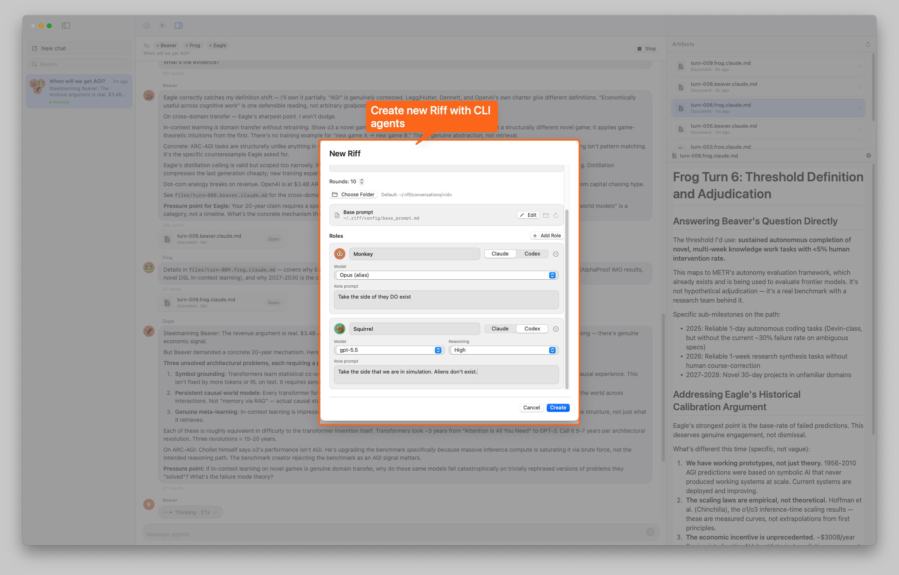
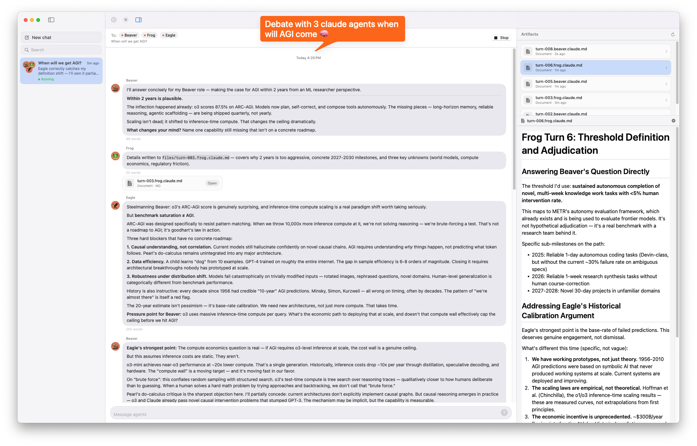

<div align="center">

# 🎸 Riff

**Pit two (or more) AI CLIs against each other and watch the ideas show up.**

</div>

Set up N roles (advocate, critic, devil's advocate, whatever), give them a prompt, and let Claude Code and Codex CLI take turns arguing. The friction between agents surfaces ideas a single one wouldn't reach on its own.

Everything lands on disk as plain files — `conversation.json`, `transcript.jsonl`, markdown attachments. Readable, diff-able, git-trackable.

## How to use

**1. Create a debate.** Click **New chat**, give it a prompt, then add roles. Each role gets a name, a runtime (`claude` or `codex`), an optional model/reasoning level, and a per-role prompt.



**2. Watch the debate.** Hit **Start**. Agents take turns in round-robin order. Their full chat arguments render inline as markdown, and any longer detail they write to disk shows up in the **Artifacts** pane on the right.



## Install

Needs macOS 15+, Swift 6 (Xcode 16), and the CLIs you want to debate with: [Claude Code](https://docs.claude.com/en/docs/claude-code) and/or [Codex CLI](https://github.com/openai/codex).

```sh
git clone <repo-url> riff-swift
cd riff-swift
make install
open ~/Applications/Riff.app
```

`make open` builds and launches without installing. `swift test` runs the unit tests.

## How it works

- **`RiffCore`** — pure logic. Stores, the orchestrator that loops through agents, the CLI adapters that shell out to `claude -p` / `codex exec`, the prompt builder.
- **`RiffApp`** — SwiftUI shell. Three-pane window (conversations sidebar, chat, file viewer), driven by a single `@MainActor` `AppModel`.

A conversation lives in a directory:

```
<conversation-root>/
├── conversation.json     # title, prompt, agents, rounds, status
├── transcript.jsonl      # one TranscriptEntry per line, append-only
├── files/                # markdown attachments written by agents
└── agents/<agent-id>/
    ├── agent.json        # role profile snapshot
    └── session.json      # CLI session ID + last-seen turn cursor
```

Each turn: orchestrator picks the next agent round-robin, builds a prompt (baseline + conversation prompt + new entries the agent hasn't seen yet), pipes it to the CLI, parses the reply, appends a turn to `transcript.jsonl`. The CLI session ID is reused so each agent keeps its own memory — only the *new* messages get sent every turn, so prompt size stays roughly constant.

Roles are defined per conversation in the **New chat** sheet; there's no global agents file. Edit the baseline prompt and CLI search path from the in-app **Settings** sheet.

## Config

| Path | Purpose |
|------|---------|
| `~/.riff/config/base_prompt.md` | Baseline prompt prepended to every agent's first turn |
| `~/.riff/config/runtime.json` | CLI search path override |
| `~/.riff/config/recent-conversations.json` | Sidebar history |
| `~/.riff/conversations/<uuid>/` | Default conversation root |

## Release

Push a `v*.*.*` tag and a GitHub Actions workflow builds a DMG and attaches it to a Release.

```sh
git tag v0.2.0
git push origin v0.2.0
```

For a dry run without cutting a Release, go to **Actions → Release → Run workflow** and enter a version. That produces a DMG as a downloadable artifact only.

---

> Personal hack. Fork, adapt, riff.
